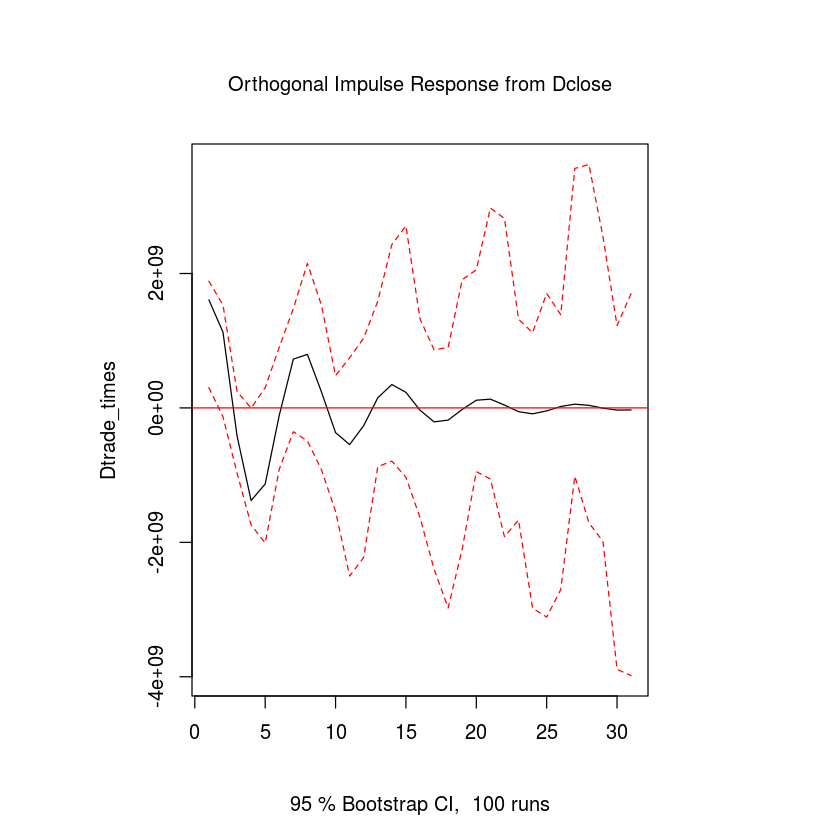

### 经济周期与股票价格的关系研究

基于经济周期对投资者的过度自信等心理进行分析，建立VAR模型，分析脉冲函数识别内生变量之间的关系。

#### 文件目录

1. data:存放过程中的数据
2. paper: 参考文献及论文
3. pics：保存的一些重要图片
4. src：源码

#### 流程图

[传送门](http://datahonor.com/2018/05/08/%E7%BB%8F%E6%B5%8E%E5%91%A8%E6%9C%9F%E4%B8%8E%E8%82%A1%E7%A5%A8%E4%BB%B7%E6%A0%BC%E5%AE%9E%E8%AF%81%E7%A0%94%E7%A9%B6/)

#### 几张好看的图

